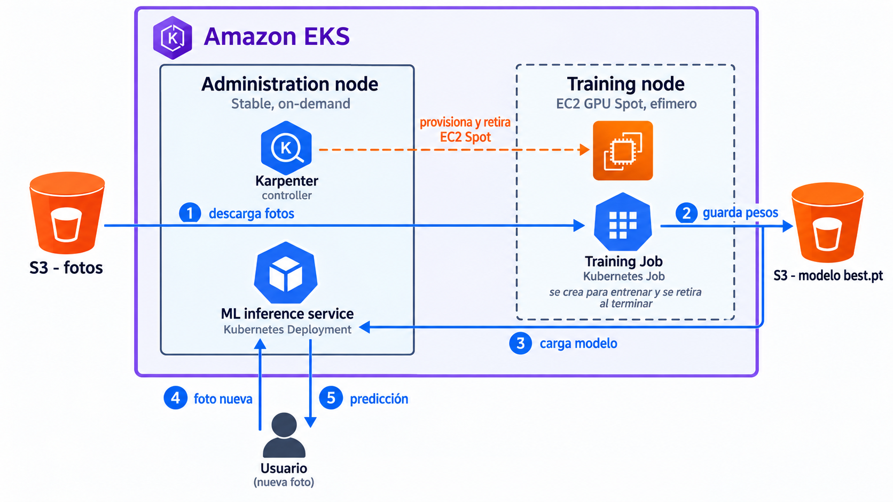
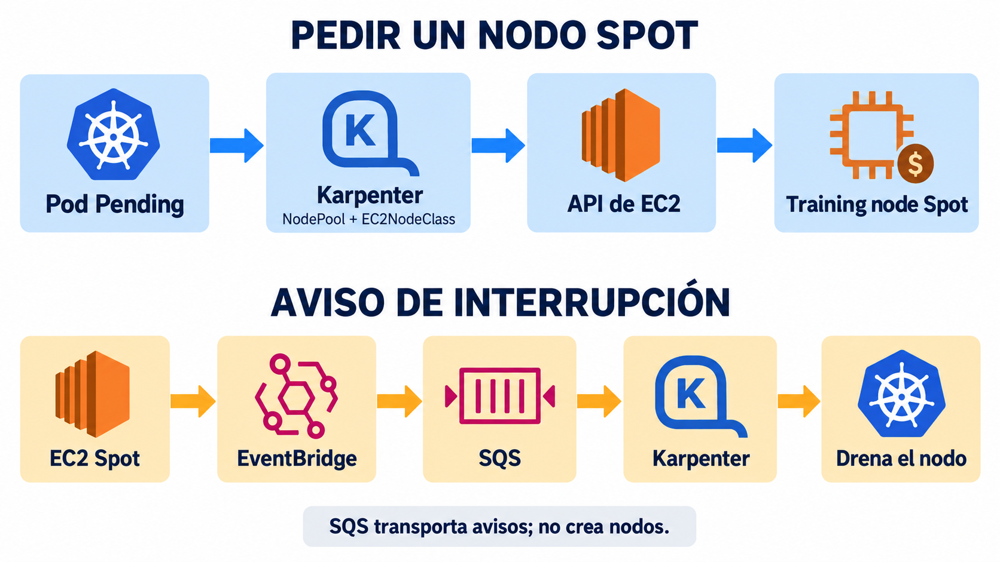

# Módulo 5 · Clase 3: entrenamiento e inferencia de frutas en EKS

En este laboratorio vas a entrenar un clasificador de frutas en un **Training node** Spot y a utilizar el modelo desde un **ML inference service** que permanece en el **Administration node**. Vas a observar cómo Karpenter solicita a AWS el nodo de entrenamiento y lo retira al finalizar el trabajo.



Las fotos se leen desde S3. El Job de entrenamiento guarda los pesos aprendidos en S3. El servicio de inferencia carga esos pesos y responde a una foto nueva; no vuelve a entrenar.

## Qué hace cada pieza

| Pieza | Función en este lab |
| --- | --- |
| **S3** | Guarda `dataset/fruits360.zip`, resultados de entrenamiento y `serving/best.pt`. Los archivos sobreviven al Training node. |
| **ECR** | Guarda dos imágenes de contenedor: una con CUDA para entrenar y otra para el servicio de inferencia. Una imagen es código y dependencias; `best.pt` son pesos aprendidos. |
| **EKS** | Ejecuta el Administration node, con Karpenter y el ML inference service, y el Training node temporal. |
| **Karpenter** | Detecta que el Training Job necesita GPU, solicita una EC2 Spot y la retira cuando queda vacía. |
| **Pod Identity/IAM** | Da credenciales temporales distintas al controlador Karpenter y a los Pods que usan S3; no hay access keys en YAML. |

El modelo es un clasificador de imágenes basado en pesos ImageNet. `train.py` cambia la última capa para las clases del dataset y ajusta pesos con predicción → error → gradientes → actualización. `infer.py` carga pesos fijos: **inferir no entrena**. Fruits-360 son fotos de estudio; un puntaje alto allí no demuestra buen desempeño con cualquier foto de celular. El lab tampoco detecta madurez ni frutas desconocidas con fiabilidad.

## Laboratorio paso a paso

Necesitás AWS CLI v2, Terraform, kubectl, Helm, Docker Buildx, Git, curl y Python 3; permisos AWS para EKS, EC2, IAM, S3, ECR, CloudFormation, SQS y EventBridge. Los comandos usan `us-east-1`. El [repositorio](https://github.com/formatec-c4/m5-clase3) es público. Usá la misma terminal durante el ejercicio: los `export` no sobreviven al cierre.

### 1. Comprobar la cuenta

```bash
git clone https://github.com/formatec-c4/m5-clase3.git
cd m5-clase3
aws sts get-caller-identity
aws ec2 describe-vpcs --filters Name=is-default,Values=true --region us-east-1 --query 'Vpcs[].VpcId' --output table
aws service-quotas get-service-quota --service-code ec2 --quota-code L-3819A6DF --region us-east-1 --query 'Quota.{Nombre:QuotaName,VCPUs:Value}' --output table
```

La primera consulta debe mostrar tu cuenta AWS; la segunda, una VPC; y la tercera, una cuota de **al menos 4 vCPU**. Si falta la VPC default o la cuota es menor, resolvelo antes de crear EKS. El nodo de entrenamiento usa Spot: Karpenter lo buscará en varias zonas, pero AWS puede no tener capacidad disponible justo durante la clase.

### 2. Crear la infraestructura con Terraform

```bash
export CLUSTER_NAME=formatec-frutas-pro
export PUBLIC_IP="$(curl -fsS https://checkip.amazonaws.com)"
terraform -chdir=terraform/foundation init
terraform -chdir=terraform/foundation validate
terraform -chdir=terraform/foundation plan -var="cluster_public_access_cidrs=[\"$PUBLIC_IP/32\"]"
terraform -chdir=terraform/foundation apply -var="cluster_public_access_cidrs=[\"$PUBLIC_IP/32\"]"
export KUBECONFIG="$PWD/.kubeconfig-m5-clase3"
aws eks update-kubeconfig --name "$CLUSTER_NAME" --region us-east-1 --kubeconfig "$KUBECONFIG" --alias "$CLUSTER_NAME" --user-alias "$CLUSTER_NAME"
kubectl config get-contexts
kubectl --context "$CLUSTER_NAME" get nodes -L node-role.formatec/admin
```

`KUBECONFIG` apunta a un archivo **exclusivo de este lab** dentro del repo (ignorado por Git). `update-kubeconfig` agrega allí el cluster, las credenciales de acceso y el contexto `formatec-frutas-pro`; no modifica `~/.kube/config`. Mantené esta variable exportada en la misma terminal durante el laboratorio.

El [Terraform](terraform/foundation/main.tf) **consulta** la VPC default y reutiliza sus subredes públicas aptas; crea EKS, un Administration node `t3a.large`, un bucket S3 privado, dos repositorios ECR y los permisos y la cola SQS que necesita Karpenter para los eventos de interrupción Spot. Etiqueta las subredes y el security group con `karpenter.sh/discovery=formatec-frutas-pro`; la `EC2NodeClass` los encontrará por esa etiqueta, sin copiar IDs en un YAML. No crea NAT ni VPC nueva. Los nodos usan subredes públicas para reducir costo: es una concesión didáctica, no el diseño privado recomendado para producción. El endpoint EKS queda limitado a tu IP `/32`; si tu IP cambia, repetí `apply` con el valor nuevo. `plan` no cobra; `apply` sí. Conservá `terraform/foundation/terraform.tfstate` para poder destruir todo después.

```bash
export S3_BUCKET="$(terraform -chdir=terraform/foundation output -raw s3_bucket)"
export TRAINER_REPO="$(terraform -chdir=terraform/foundation output -raw trainer_repository_url)"
export INFERENCE_REPO="$(terraform -chdir=terraform/foundation output -raw inference_repository_url)"
aws s3api get-public-access-block --bucket "$S3_BUCKET" --region us-east-1
aws ecr describe-repositories --repository-names "$CLUSTER_NAME-trainer" "$CLUSTER_NAME-inference" --region us-east-1 --query 'repositories[].repositoryName'
```

Terraform obtiene de la plantilla **oficial y fijada a Karpenter 1.12.1** el rol EC2 del futuro Training node, seis políticas del controlador, una cola SQS y reglas EventBridge para interrupciones Spot. La stack queda gestionada por Terraform. La plantilla se puede [leer antes de aplicar](https://raw.githubusercontent.com/aws/karpenter-provider-aws/v1.12.1/website/content/en/preview/getting-started/getting-started-with-karpenter/cloudformation.yaml). `CAPABILITY_NAMED_IAM` autoriza sus recursos IAM con nombres conocidos.

La cola SQS **no crea nodos**. Hay dos recorridos diferentes: uno para pedir capacidad y otro para avisar que una instancia Spot puede perderse.

### 3. Entender los permisos y la decisión de escalado

Hay **tres roles, no uno solo**:

| Identidad | Quién la usa | Permiso esencial |
| --- | --- | --- |
| Rol del **Training node** | EC2 creada por Karpenter | Registrarse en EKS y descargar imágenes privadas de ECR. El `access entry` `EC2_LINUX` la admite en el clúster. |
| Rol del **controlador Karpenter** | Pod `kube-system/karpenter` | Consultar AWS, crear/retirar EC2, pasar el rol al nodo y leer interrupciones SQS. |
| Rol **frutas-s3** | Training Job y ML inference service | Listar **este bucket** y leer/escribir sus objetos. Ambos comparten rol en este ejercicio; un servicio de inferencia de producción tendría solo lectura. |

La *trust policy* define **quién puede asumir** cada rol; la *permissions policy*, **qué puede hacer después**. Para los Pods: Pod → ServiceAccount → asociación EKS Pod Identity → agente → credenciales temporales → API de AWS. El nodo usa su rol EC2 para ECR; no se le da permiso S3 a toda aplicación del nodo. El [agente Pod Identity](https://docs.aws.amazon.com/eks/latest/userguide/pod-identities.html) se instaló como complemento EKS desde Terraform.

Las seis políticas del controlador separan ciclo de vida EC2 (`NodeLifecycle`), paso del rol (`IAMIntegration`), consulta EKS (`EKSIntegration`), interrupciones (`Interruption`), descubrimiento de recursos (`ResourceDiscovery`) y cambios de zona (`ZonalShift`). Para ver la configuración **real** en tu cuenta:

```bash
aws cloudformation describe-stack-resources --stack-name "Karpenter-$CLUSTER_NAME" --region us-east-1 --query 'StackResources[].{Tipo:ResourceType,ID:PhysicalResourceId}' --output table
aws iam list-attached-role-policies --role-name "$CLUSTER_NAME-karpenter" --query 'AttachedPolicies[].PolicyName' --output table
aws eks list-pod-identity-associations --cluster-name "$CLUSTER_NAME" --region us-east-1 --query 'associations[].{Namespace:namespace,ServiceAccount:serviceAccount}' --output table
terraform -chdir=terraform/foundation state show aws_eks_access_entry.karpenter_node
```

Para leer **acciones y recursos**, no solo nombres, abrí una política del controlador. `IAMIntegration` muestra `iam:PassRole`: Karpenter puede entregar al Training node su rol EC2, con condiciones que limitan a qué rol y servicio. En una instalación nueva, la versión de esta política es `v1`.

```bash
export AWS_ACCOUNT_ID="$(aws sts get-caller-identity --query Account --output text)"
aws iam get-policy-version --policy-arn "arn:aws:iam::$AWS_ACCOUNT_ID:policy/KarpenterControllerIAMIntegrationPolicy-$CLUSTER_NAME" --version-id v1 --query 'PolicyVersion.Document' --output json
aws iam get-role-policy --role-name "$CLUSTER_NAME-s3" --policy-name frutas-artifacts --query 'PolicyDocument.Statement' --output json
```

**Cuando falta un nodo para entrenar:**

1. Aplicamos el Training Job. Su Pod pide una GPU y Kubernetes no puede ubicarlo en el Administration node; queda `Pending`.
2. Karpenter ve ese Pod y busca un `NodePool` que lo admita. El `NodePool` permite un nodo GPU **Spot**; la `EC2NodeClass` indica rol IAM, AMI, subredes, security group y disco.
3. Karpenter crea un `NodeClaim` en Kubernetes y, con los permisos de su rol, solicita a la **API de EC2** una instancia que cumpla esas condiciones. **EventBridge y SQS no intervienen en esta solicitud.**
4. Si AWS encuentra capacidad Spot, la EC2 arranca, se registra en EKS como Training node y Kubernetes programa allí el Pod. Si no encuentra capacidad, el Pod sigue pendiente y Karpenter reintenta; no cambiamos automáticamente a On-Demand.
5. Al terminar y quitar el Job, el nodo queda vacío. Tras `consolidateAfter: 1m`, Karpenter puede terminar la EC2 por la API de AWS. La SQS tampoco interviene en este apagado normal.

**Si AWS anuncia una interrupción Spot:** EC2 emite el aviso → una regla de **EventBridge** lo envía a **SQS** → Karpenter lee la cola → marca y drena el nodo antes de que AWS lo retire. Si el Job aún necesita GPU, Karpenter intenta pedir otro nodo Spot. Este aviso no garantiza que haya reemplazo disponible ni que un entrenamiento interrumpido continúe desde el mismo punto. La plantilla gestionada por Terraform crea las reglas y la cola; `settings.interruptionQueue` conecta el controlador con ella. [Referencia de Karpenter sobre interrupciones](https://karpenter.sh/v1.12/concepts/disruption/).



### 4. Instalar Karpenter y aplicar su configuración

Helm instala el **controlador** Karpenter en el Administration node. `settings.clusterName` le indica qué EKS administra y `settings.interruptionQueue` qué cola SQS lee para reaccionar a avisos Spot. Todavía no se crea ninguna EC2 de entrenamiento.

```bash
helm upgrade --install karpenter oci://public.ecr.aws/karpenter/karpenter --version 1.12.1 --namespace kube-system --kube-context "$CLUSTER_NAME" --values k8s/karpenter-values.yaml --set settings.clusterName="$CLUSTER_NAME" --set settings.interruptionQueue="$CLUSTER_NAME" --wait
kubectl --context "$CLUSTER_NAME" -n kube-system rollout status deployment/karpenter --timeout=10m
kubectl --context "$CLUSTER_NAME" apply -f k8s/karpenter-nodeclass.yaml
kubectl --context "$CLUSTER_NAME" apply -f k8s/karpenter-nodepool.yaml
helm repo add nvidia https://nvidia.github.io/k8s-device-plugin
helm repo update
helm upgrade --install nvidia-device-plugin nvidia/nvidia-device-plugin --version 0.19.3 --namespace kube-system --kube-context "$CLUSTER_NAME" --values k8s/nvidia-values.yaml
kubectl --context "$CLUSTER_NAME" apply -f k8s/frutas-s3-serviceaccount.yaml
kubectl --context "$CLUSTER_NAME" wait --for=condition=Ready ec2nodeclass/frutas-training --timeout=180s
kubectl --context "$CLUSTER_NAME" wait --for=condition=Ready nodepool/frutas-gpu --timeout=180s
kubectl --context "$CLUSTER_NAME" get nodepools,ec2nodeclasses,nodeclaims
kubectl --context "$CLUSTER_NAME" get nodepool frutas-gpu -o yaml
kubectl --context "$CLUSTER_NAME" get ec2nodeclass frutas-training -o yaml
```

Leé los dos manifiestos que acabás de aplicar:

- [NodePool](k8s/karpenter-nodepool.yaml) limita a **un Training node**, tamaño `xlarge`, familias GPU `g4dn/g5/g6/g6e` y **solo Spot**. `WhenEmpty` permite retirarlo cuando no tenga Jobs.
- [EC2NodeClass](k8s/karpenter-nodeclass.yaml) define el rol EC2 del Training node, descubrimiento de subredes/security group por etiquetas, AMI y disco. No incluye claves AWS.
- El plugin NVIDIA anuncia `nvidia.com/gpu` cuando aparece la EC2. Sin ese anuncio, el Pod no puede usar la GPU.

En este punto `kubectl get nodeclaims` debe estar vacío: aún no pedimos GPU. Si el registry OCI público devuelve `403` por un login viejo de Helm, ejecutá `helm registry logout public.ecr.aws` y repetí el primer comando.

### 5. Subir las fotos y las imágenes de contenedor

```bash
curl --fail --location --retry 3 --output fruits360.zip https://codeload.github.com/fruits-360/fruits-360-100x100/zip/45ed8feceec7e2512d47042662773cbd9a4c9c0e
aws s3 cp fruits360.zip "s3://$S3_BUCKET/dataset/fruits360.zip" --region us-east-1
aws ecr get-login-password --region us-east-1 | docker login --username AWS --password-stdin "$(aws sts get-caller-identity --query Account --output text).dkr.ecr.us-east-1.amazonaws.com"
docker buildx build --platform linux/amd64 --push -f Dockerfile -t "$TRAINER_REPO:v1" .
docker buildx build --platform linux/amd64 --push -f Dockerfile.serve -t "$INFERENCE_REPO:v1" .
```

Las fotos se guardan en S3; ECR guarda el código y las dependencias de entrenamiento e inferencia. `linux/amd64` permite construir las imágenes incluso desde una Mac con Apple Silicon. La descarga y el build pueden tardar varios minutos.

### 6. Entrenar y observar el Training node

El modo `smoke` entrena dos épocas. Al crear el Job, compará los nodos existentes con los recursos pedidos por el Pod:

```bash
kubectl --context "$CLUSTER_NAME" get nodes -L node-role.formatec/admin,karpenter.sh/nodepool
helm install frutas-train charts/training-job --kube-context "$CLUSTER_NAME" --set mode=smoke --set artifactPrefix=lab --set image="$TRAINER_REPO:v1" --set s3Bucket="$S3_BUCKET"
kubectl --context "$CLUSTER_NAME" get jobs,pods,nodeclaims,nodes -w
```

El Job solicita 1 GPU, 3 CPU y 12 GiB: no cabe en el Administration node. Kubernetes deja el Pod pendiente; Karpenter crea un `NodeClaim`, solicita una EC2 Spot y aparece el Training node. Ctrl+C detiene solo la vista. Verificá en AWS que la compra fue Spot y seguí los logs:

```bash
kubectl --context "$CLUSTER_NAME" get nodes -L karpenter.sh/capacity-type,node.kubernetes.io/instance-type
aws ec2 describe-instances --filters Name=tag:karpenter.sh/nodepool,Values=frutas-gpu Name=instance-state-name,Values=running --region us-east-1 --query 'Reservations[].Instances[].{ID:InstanceId,Tipo:InstanceType,Compra:InstanceLifecycle}' --output table
kubectl --context "$CLUSTER_NAME" logs -f job/entrenar-frutas-smoke
kubectl --context "$CLUSTER_NAME" wait --for=condition=complete job/entrenar-frutas-smoke --timeout=3600s
aws s3 ls "s3://$S3_BUCKET/lab/" --recursive --region us-east-1
```

Si no aparece la EC2, revisá eventos del Pod y logs de Karpenter:

```bash
kubectl --context "$CLUSTER_NAME" describe pod -l job-name=entrenar-frutas-smoke
kubectl --context "$CLUSTER_NAME" -n kube-system logs deployment/karpenter --tail=80
```

`UnfulfillableCapacity` o `InsufficientInstanceCapacity` significa que AWS no ofreció una de las instancias Spot permitidas en ese momento, aunque tengas cuota. Este NodePool no pasa a On-Demand. Reintentá más tarde; si vas a detener el laboratorio, quitá el Job y seguí el borrado del final.

### 7. Publicar el modelo e inferir una foto

El Job escribió resultados en `lab/results/`. Elegí el mejor checkpoint y copiálo a `serving/`, que es la ruta que leerá el servicio de inferencia:

```bash
mkdir -p runs/lab
aws s3 sync "s3://$S3_BUCKET/lab/results/" runs/lab/ --region us-east-1
python3 select_best.py runs/lab
aws s3 cp runs/lab/best.pt "s3://$S3_BUCKET/serving/best.pt" --region us-east-1
aws s3 cp runs/lab/summary.json "s3://$S3_BUCKET/serving/summary.json" --region us-east-1
```

Retirá el Job. Karpenter podrá retirar el Training node vacío. El Administration node permanece y allí desplegamos el ML inference service:

```bash
helm uninstall frutas-train --kube-context "$CLUSTER_NAME"
helm upgrade --install frutas-predictor charts/predictor --kube-context "$CLUSTER_NAME" --set image="$INFERENCE_REPO:v1" --set s3Bucket="$S3_BUCKET"
kubectl --context "$CLUSTER_NAME" rollout status deployment/frutas-predictor --timeout=10m
kubectl --context "$CLUSTER_NAME" port-forward service/frutas-predictor 8080:80
```

Abrí **http://127.0.0.1:8080** y cargá una foto propia. Viaja a EKS por `port-forward`; la inferencia no ocurre en el navegador. Los cinco puntajes mostrados son relativos, no probabilidades calibradas. En otra terminal, observá cómo desaparece el Training node:

```bash
kubectl --context "$CLUSTER_NAME" get nodeclaims,nodes -w
```

## Borrar el laboratorio

**Destruye datos y recursos facturables.** Descargá primero cualquier modelo que quieras conservar. Cortá `port-forward` con Ctrl+C. Quitá las aplicaciones y esperá que no queden NodeClaims mientras Karpenter aún funciona:

```bash
helm uninstall frutas-predictor --kube-context "$CLUSTER_NAME" --ignore-not-found
helm uninstall frutas-train --kube-context "$CLUSTER_NAME" --ignore-not-found
kubectl --context "$CLUSTER_NAME" get nodeclaims,nodes
```

Cuando ya no exista el Training node, eliminá sus reglas de aprovisionamiento y después el controlador:

```bash
kubectl --context "$CLUSTER_NAME" delete -f k8s/karpenter-nodepool.yaml
kubectl --context "$CLUSTER_NAME" delete -f k8s/karpenter-nodeclass.yaml
helm uninstall nvidia-device-plugin --namespace kube-system --kube-context "$CLUSTER_NAME" --ignore-not-found
helm uninstall karpenter --namespace kube-system --kube-context "$CLUSTER_NAME" --ignore-not-found
kubectl --context "$CLUSTER_NAME" delete -f k8s/frutas-s3-serviceaccount.yaml --ignore-not-found
terraform -chdir=terraform/foundation destroy -var="cluster_public_access_cidrs=[\"$PUBLIC_IP/32\"]"
terraform -chdir=terraform/foundation state list
kubectl config delete-context "$CLUSTER_NAME"
rm .kubeconfig-m5-clase3
unset KUBECONFIG
```

`kubectl config delete-context` borra la entrada del contexto; `rm` elimina el kubeconfig aislado completo (incluidas sus entradas de cluster y usuario). Hacé estos tres últimos comandos **solo cuando `terraform destroy` haya terminado bien**. Si alguna vez agregaste un contexto a tu kubeconfig personal, podés listar los nombres con `kubectl config get-contexts` y eliminar solo el deseado con `kubectl config delete-context NOMBRE`; esto no borra el cluster en AWS.

El bucket usa `force_destroy` y ECR `force_delete`: **Terraform elimina también fotos, modelos e imágenes**. No borres `terraform.tfstate` antes del destroy. Si falla, leé el error y repetí tras resolver la dependencia; no elimines el state para “arreglarlo”. Verificá en AWS que EKS, EC2, S3 y ECR realmente desaparecieron. La facturación puede reflejarse con demora.

## Diagnóstico rápido

| Síntoma | Revisar |
| --- | --- |
| `terraform apply` falla | VPC default, dos subredes públicas, permisos AWS, cuotas y stack CloudFormation. |
| Karpenter no arranca | Asociación Pod Identity, rol/políticas del controlador y `kubectl -n kube-system logs deployment/karpenter`. |
| Job `Pending` sin NodeClaim | Eventos del Pod, restricciones del NodePool y logs Karpenter. |
| NodeClaim sin EC2 lista | Cuota/capacidad Spot, rol del nodo, `EC2_LINUX`, subred e IP pública. |
| GPU lista pero Job pendiente | Plugin NVIDIA y recurso `nvidia.com/gpu`. |
| Predictor no está listo | `serving/best.pt`, rol S3/Pod Identity y logs del Deployment. |
| Clasificación mala | Distancia entre Fruits-360 y fotos reales; no necesariamente infraestructura. |

```bash
kubectl --context "$CLUSTER_NAME" get pods -A -o wide
kubectl --context "$CLUSTER_NAME" get events -A --sort-by=.lastTimestamp
kubectl --context "$CLUSTER_NAME" -n kube-system logs deployment/karpenter --tail=100
aws s3 ls "s3://$S3_BUCKET/" --recursive --region us-east-1
```

No hay Ingress público, DNS, presupuesto automático ni apagado automático de EKS. Referencias: [Karpenter](https://karpenter.sh/v1.12/getting-started/getting-started-with-karpenter/), [NodePools](https://karpenter.sh/v1.12/concepts/nodepools/), [EKS Pod Identity](https://docs.aws.amazon.com/eks/latest/userguide/pod-identities.html). Dataset Fruits-360 de Mihai Oltean, licencia [CC BY-SA 4.0](https://github.com/fruits-360/fruits-360-100x100/blob/main/LICENSE).
